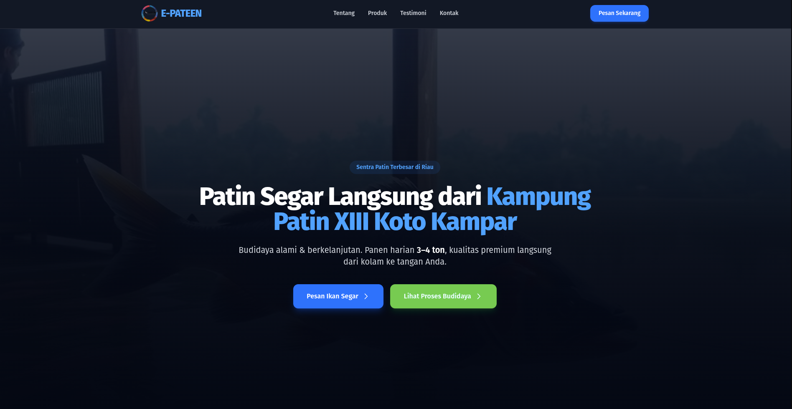
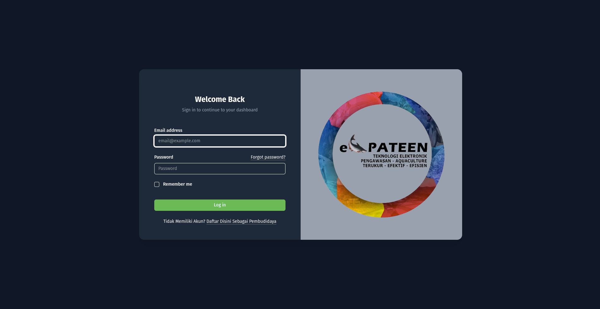
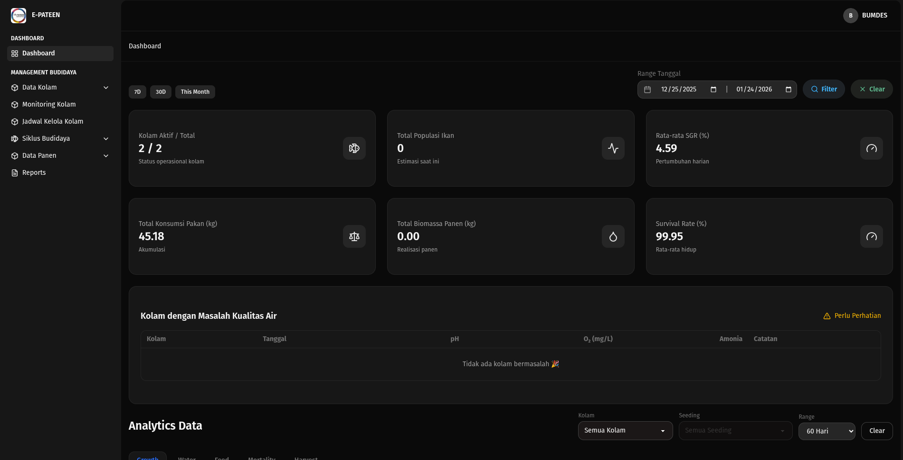

<p align="center">

</p>

# E-Pateen Platform 🐟🌱

E-Pateen adalah platform manajemen budidaya perikanan berbasis web yang dirancang untuk membantu **pembudidaya** dan **admin** dalam mengelola siklus budidaya ikan secara digital, terstruktur, dan berbasis data — mulai dari penebaran benih (seeding), monitoring kualitas air, pemberian pakan, sampling pertumbuhan, hingga estimasi dan realisasi panen.

Proyek ini dibangun dengan arsitektur modern menggunakan **Laravel + Inertia + React**, serta mendukung deployment menggunakan **Docker** maupun instalasi manual di server.


### Form Login Pembudidaya & Admin



### Dashboard

---

## ✨ Fitur Utama

### 🌐 Landing Page (Publik)

- Halaman utama (Landing Page)
- Menu:
    - **Tentang**
    - **Testimoni**
    - **Kontak**

### 🔐 Panel Admin & Pembudidaya

#### Autentikasi

- Login
- Registrasi Pembudidaya

#### Dashboard

- Statistik Kolam
- Analitik Produksi
- Ringkasan Aktivitas
- Highlight KPI

#### Manajemen Pengguna

- Create, Update, Delete pengguna
- Filter berdasarkan Role
- Searching

#### Data Kolam

- Create, Update, Delete kolam
- Filter berdasarkan:
    - Kondisi Kolam
    - Status Produksi
    - Tipe Kolam

- Searching

#### Histori Kolam

- Tracking aktivitas kolam
- Log aktivitas:
    - Create / Update / Delete Kolam
    - Siklus Budidaya:
        - Seeding
        - Sampling
        - Realisasi Panen

#### Monitoring Kualitas Air

- Create, Update, Delete data monitoring
- Parameter kualitas air kolam

#### Jadwal Kelola Kolam

- Create, Update, Delete jadwal
- Set status kegiatan
- Filter berdasarkan kolam dan status kegiatan

#### Siklus Budidaya – Penebaran Benih (Seeding)

- Create seeding baru
- Update informasi seeding
- Manajemen pergerakan stok benih
- Closing seeding setelah panen selesai
- Filter berdasarkan kolam
- Searching

#### Pemberian Pakan

- Create, Update, Delete data pakan
- Filter berdasarkan kolam
- Searching

#### Sampling Pertumbuhan

- Create data sampling baru
- Filter berdasarkan kolam

#### Estimasi Panen

- View estimasi panen otomatis
- Auto-generate berdasarkan:
    - Seeding baru
    - Update dari sampling pertumbuhan

#### Realisasi Panen

- Create & Update data panen
- Filter berdasarkan kolam
- Searching

#### Reports & KPI

- Laporan KPI
- Rekap dari kolam hingga realisasi panen

> 🔍 **Catatan:** Semua fitur mendukung **Searching & Filtering** untuk kemudahan pengelolaan data.

---

## 🧱 Tech Stack

### Backend

- **Laravel 12**
- **PHP 8.2**
- **MySQL**

### Frontend

- **Inertia.js**
- **React**
- **Tailwind CSS**
- **DaisyUI**

### Tooling

- **Node / NPM**
- **Docker & Docker Compose** (Development & Production Ready)

---

## 📦 Arsitektur

```
Client (Browser)
   ↓
React + Inertia
   ↓
Laravel 12 (API & SSR Bridge)
   ↓
MySQL Database
```

---

## 🚀 Instalasi & Setup

Tersedia dua metode instalasi:

- **A. Menggunakan Docker (Direkomendasikan)**
- **B. Tanpa Docker (Manual Server Setup)**

---

# A. Instalasi Menggunakan Docker

## 1. Prasyarat

Pastikan server / local machine sudah terinstall:

- Docker
- Docker Compose
- Git

## 2. Clone Repository

```bash
git clone https://github.com/username/e-pateen.git
cd e-pateen
```

## 3. Konfigurasi Environment

Salin file `.env.example` menjadi `.env`:

```bash
cp .env.example .env
```

Sesuaikan konfigurasi database Docker:

```env
DB_CONNECTION=mysql
DB_HOST=mysql
DB_PORT=3306
DB_DATABASE=e_pateen
DB_USERNAME=root
DB_PASSWORD=root
```

## 4. Build & Jalankan Container

```bash
docker compose build
docker compose up -d
```

## 5. Install Dependency

Masuk ke container app:

```bash
docker compose exec app bash
```

Lalu jalankan:

```bash
composer install
php artisan key:generate
php artisan migrate --seed
npm install
npm run build
```

## 6. Akses Aplikasi

Buka browser:

```
http://localhost
```

Atau sesuai port yang dikonfigurasi di `docker-compose.yml`.

---

# B. Instalasi Tanpa Docker (Manual Server)

## 1. Prasyarat Server

Pastikan server memiliki:

- PHP 8.2+
- Composer
- MySQL
- Node.js & NPM
- Web Server (Nginx / Apache)

## 2. Clone Repository

```bash
git clone https://github.com/username/e-pateen.git
cd e-pateen
```

## 3. Konfigurasi Environment

```bash
cp .env.example .env
```

Edit `.env` sesuai konfigurasi server:

```env
APP_ENV=production
APP_DEBUG=false
APP_URL=https://your-domain.com

DB_CONNECTION=mysql
DB_HOST=127.0.0.1
DB_PORT=3306
DB_DATABASE=e_pateen
DB_USERNAME=db_user
DB_PASSWORD=db_password
```

## 4. Install Dependency Backend

```bash
composer install --optimize-autoloader --no-dev
php artisan key:generate
php artisan migrate --seed
php artisan storage:link
```

## 5. Install & Build Frontend

```bash
npm install
npm run build
```

## 6. Konfigurasi Web Server

### Nginx Example

```nginx
server {
    listen 80;
    server_name your-domain.com;
    root /var/www/e-pateen/public;

    index index.php;

    location / {
        try_files $uri $uri/ /index.php?$query_string;
    }

    location ~ \.php$ {
        include fastcgi_params;
        fastcgi_pass unix:/run/php/php8.2-fpm.sock;
        fastcgi_param SCRIPT_FILENAME $document_root$fastcgi_script_name;
    }
}
```

Reload Nginx:

```bash
sudo systemctl reload nginx
```

---

## 🔐 Default Role & Akses

| Role        | Akses                                                  |
| ----------- | ------------------------------------------------------ |
| Admin       | Full akses seluruh fitur                               |
| Pembudidaya | Kelola kolam, seeding, pakan, sampling, panen, laporan |

---

## 📊 KPI & Reporting

Sistem laporan mencakup:

- Produktivitas Kolam
- Efektivitas Pakan
- Pertumbuhan Ikan
- Estimasi vs Realisasi Panen

Semua data ditampilkan dalam bentuk ringkasan dan tabel analitik.

---

## 🛡️ Keamanan

- Laravel Authentication & Authorization
- Role-based Access Control (RBAC)
- Validasi Input Backend & Frontend
- Proteksi CSRF

---

## 🤝 Kontribusi

Kontribusi sangat terbuka!

1. Fork repository
2. Buat branch fitur (`git checkout -b fitur-baru`)
3. Commit perubahan (`git commit -m 'Menambahkan fitur baru'`)
4. Push ke branch (`git push origin fitur-baru`)
5. Buat Pull Request

---

## 📄 Lisensi

Proyek ini menggunakan lisensi **MIT**. Silakan gunakan, modifikasi, dan distribusikan sesuai kebutuhan.

---

## 📬 Kontak

Jika ada pertanyaan atau kerja sama:

- Email: [admin@e-pateen.id](mailto:admin@e-pateen.id)
- Website: [https://e-pateen.id](https://e-pateen.id)

---

> Dibangun dengan ❤️ untuk mendukung digitalisasi budidaya perikanan Indonesia
